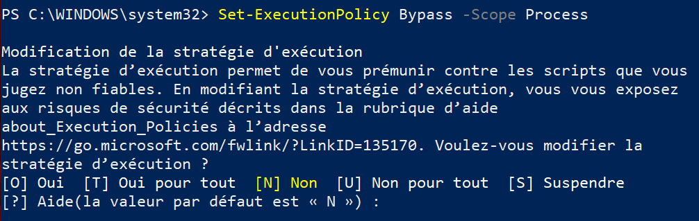
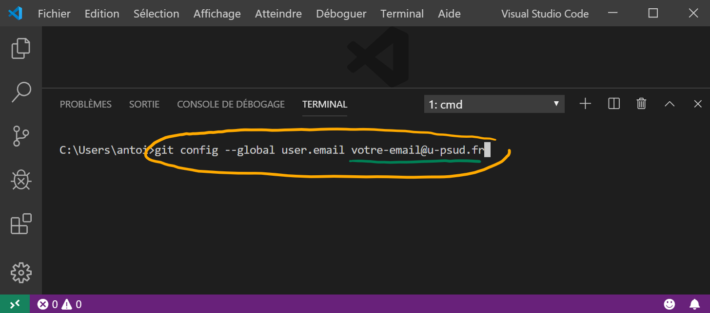
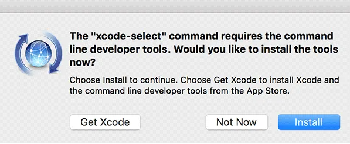
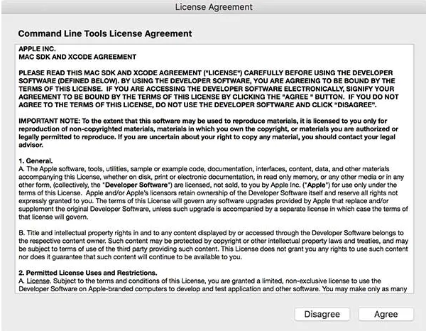
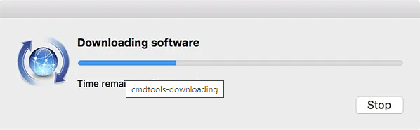
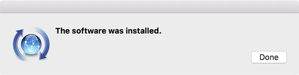

# Génie Logiciel

Dépôt pour les cours de GL à l'IUT de Cachan

## Organisation des dossiers

* Dossier `include`
* Dossier `src`

## Règles à respecter

* Avant de démarrer un __projet C et/ou C++__, vous devez avoir un __clone local__ de votre
repo.
* Chaque fichier `.h` ou `.hpp` créé doit être placé dans le dossier `include`.
* Chaque fichier `.c` ou `.cpp` créé doit être placé dans le dossier `src`.

## Par où commencer

### Comment cloner localement votre repo

* Récupérér le lien de votre repo :
    * Cliquer sur le bouton vert __Code__ et copier l'URL

* Cloner avec __Visual Studio Code__ :
    * Ouvrir Visual Studio Code
    * Appuyer sur `F1`, ensuite taper `clone`, choisissez `Git: Clone`
    * Coller l'URL dans le champ demandé
    * Sauvegarder quelque part (à l'IUT, ce sera dans votre dossier qui est
    dans `C:\Travail`)
    * Cliquer sur `Open Repository`


### Branches, Commits, et Synchronisation
Pas d'explications, il faut pratiquer !

## À la maison

<details>
<summary>Installation pour Windows (<i>cliquer pour développer</i>)</summary>

### Installation des logiciels
Vous devez installer les logiciels qui vous seront utiles pour travailler à
la maison. Pour ce faire :
* Taper _powershell_ sur le bouton _Démarrer_,
**faire un clic-droit** sur `Windows PowerShell` puis cliquer
`Exécuter en tant qu'administrateur`
* Taper la 1ère commande suivante dans la fenêtre de commande powershell puis
taper la touche _Entrée_
```powershell
Set-ExecutionPolicy Bypass -Scope Process
```
* Arrivé au stade illustré ci-dessous, taper `T` puis la touche _Entrée_
<br /><br /><br /><br />
* Taper la 2ème commande suivante dans la fenêtre de commande powershell puis
taper la touche _Entrée_
```powershell
Set-ExecutionPolicy Bypass -Scope Process -Force; [System.Net.ServicePointManager]::SecurityProtocol = [System.Net.ServicePointManager]::SecurityProtocol -bor 3072; iex ((New-Object System.Net.WebClient).DownloadString('https://chocolatey.org/install.ps1'))
```
* Taper la 3ème commande suivante dans la fenêtre de commande powershell puis
taper la touche _Entrée_
```powershell
choco install -y ninja cmake --installargs 'ADD_CMAKE_TO_PATH=System' mingw gcc-arm-embedded git vscode 7zip
```

### Paramétrage du versionning dans _Visual Studio Code_
* Redémarrer _Visual Studio Code_
* Suivre les captures d'écran ci-dessous pour paramétrer vos
identifiants sur _Visual Studio Code_
<br /><br />
<br /><br />
<br /><br />

### Installation des extensions dans _Visual Studio Code_
* Redémarrer _Visual Studio Code_
* Cloner votre repo
* Accepter toutes les requêtes d'installation d'extensions de
_Visual Studio Code_

</details>

<details>
<summary>Installation pour Mac (<i>cliquer pour développer</i>)</summary>

### Installation des logiciels
Vous devez installer les logiciels qui vous seront utiles pour travailler à
la maison. Pour ce faire :
* Commencer par installer les logiciels suivants:
    * [Visual Studio Code](https://code.visualstudio.com/download)
    * [XCode](https://apps.apple.com/fr/app/xcode/id497799835?mt=12)
* Ouvrir un _terminal_
* Taper la 1ère commande suivante dans la fenêtre de commande puis
taper la touche _Entrée_
```bash
xcode-select --install
```
* Suivre les captures d'écran ci-dessous après avoir taper la
commande précédente
<br /><br />
<br /><br />
<br /><br />
<br /><br />
* Taper la 2ème commande suivante dans la fenêtre de commande puis
taper la touche _Entrée_
```bash
/bin/bash -c "$(curl -fsSL https://raw.githubusercontent.com/Homebrew/install/master/install.sh)"
```

* Taper la 3ème commande suivante dans la fenêtre de commande puis
taper la touche _Entrée_
```bash
brew install cmake ninja git
```

### Paramétrage du versionning dans _Visual Studio Code_
* Redémarrer _Visual Studio Code_
* Suivre les captures d'écran ci-dessous pour paramétrer vos
identifiants sur _Visual Studio Code_
<br /><br />
<br /><br />
<br /><br />

### Installation des extensions dans _Visual Studio Code_
* Redémarrer _Visual Studio Code_
* Cloner votre repo
* Accepter toutes les requêtes d'installation d'extensions de
_Visual Studio Code_

</details>
